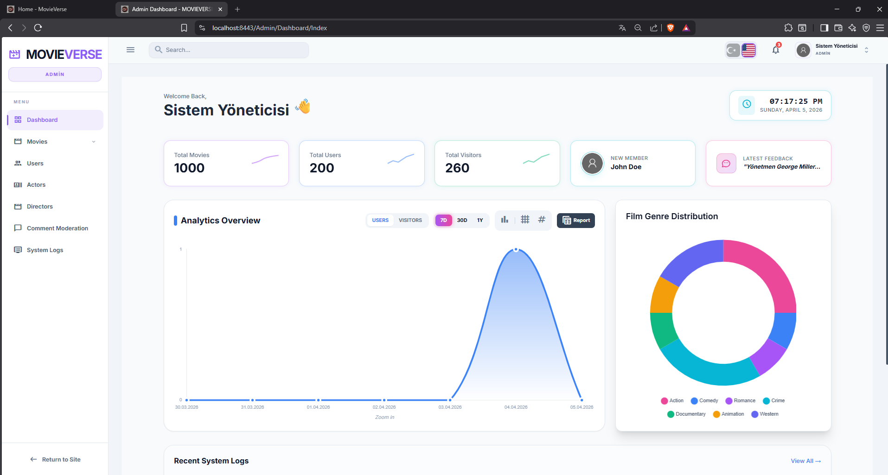
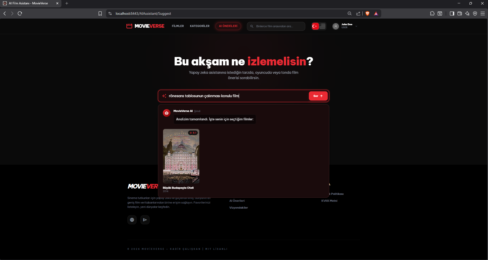
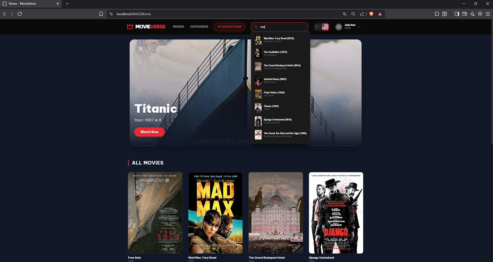
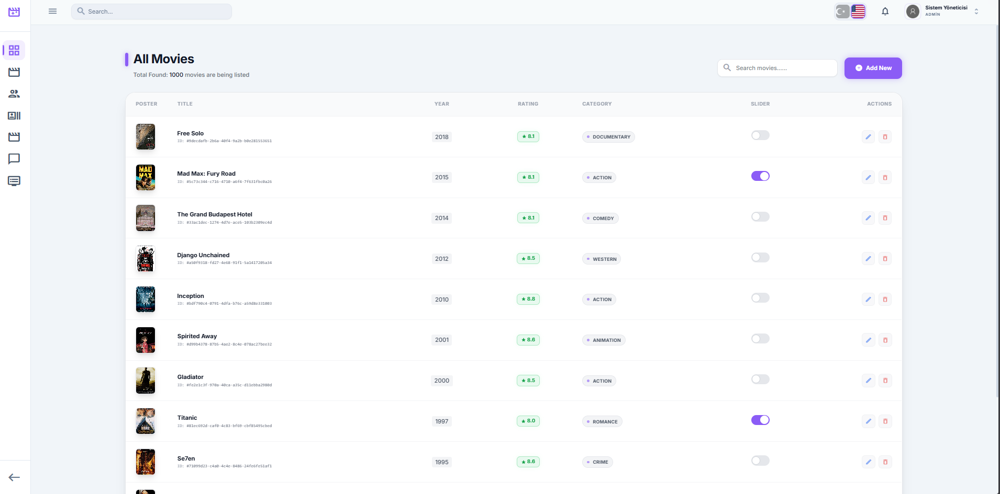
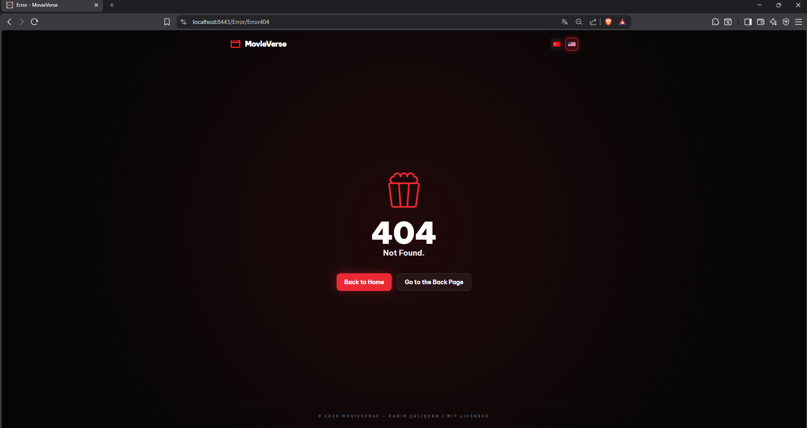
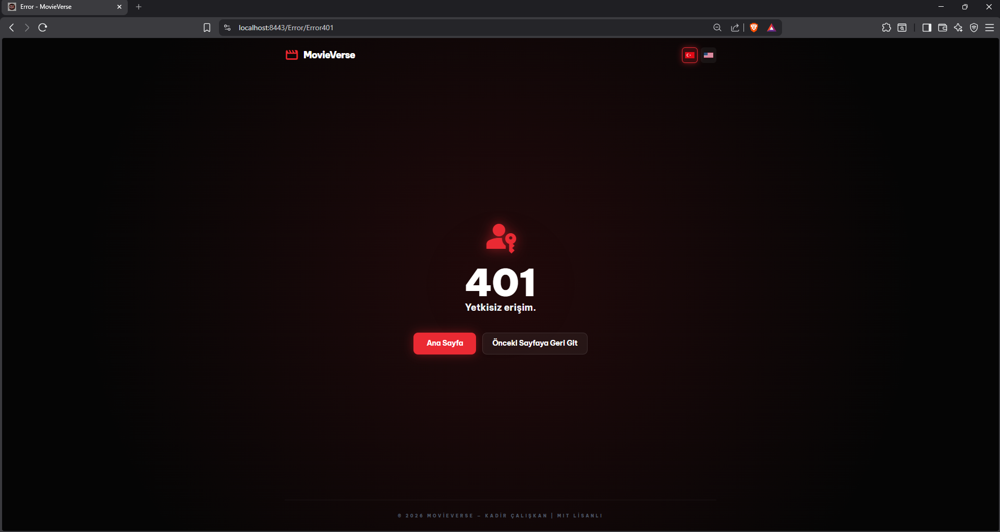

\# MovieVerse 🎬


MovieVerse, \*\*.NET 9\*\* ve \*\*Clean Architecture\*\* prensipleriyle geliştirilmiş, yüksek performanslı bir film keşif ve yönetim platformudur. Proje; modern mimari yaklaşımlarını (CQRS, Mediator), gelişmiş arama yeteneklerini, yapay zeka destekli öneri sistemlerini ve önbellekleme stratejilerini bir araya getirerek gerçek dünya senaryolarına uygun bir deneyim sunar.


\## 🚀 Öne Çıkan Özellikler


\- \*\*Yapay Zeka Asistanı (RAG \& Gemini):\*\* Retrieval-Augmented Generation (RAG) mimarisi ve Google Gemini API kullanılarak, veritabanındaki veriler üzerinden kullanıcılara akıllı ve bağlamsal film önerileri sunan özel AI sayfası.

\- \*\*Gelişmiş Arama:\*\* Elasticsearch entegrasyonu ile milyonlarca veri arasında milisaniyeler içinde arama.

\- \*\*Yüksek Performans:\*\* Redis Caching ile sık erişilen verilerde minimum gecikme.

\- \*\*Anlık Bildirimler:\*\* SignalR ile admin paneline düşen gerçek zamanlı etkileşimler.

\- \*\*Modern UI:\*\* Tailwind CSS ile tasarlanmış, tamamen responsive kullanıcı arayüzü.

\- \*\*Konteynerleştirme:\*\* Docker Compose ile tüm altyapı (Redis, Elastic) tek komutla hazır.


\## 🛠️ Teknoloji Yığını


\### Backend \& Mimari

\- \*\*Framework:\*\* .NET 9 (ASP.NET MVC)

\- \*\*Architecture:\*\* Clean Architecture (Domain, Application, Infrastructure, Web)

\- \*\*Patterns:\*\* CQRS \& MediatR, Repository \& Unit of Work, AutoMapper

\- \*\*Database:\*\* Entity Framework Core \& SQL Server

\- \*\*AI \& Search:\*\* \*\*Google Gemini API (RAG)\*\*, Elasticsearch \& Kibana

\- \*\*Caching:\*\* Redis

\- \*\*Infrastructure:\*\* Docker \& Docker Compose


\### Frontend

\- \*\*Styling:\*\* Tailwind CSS

\- \*\*Real-time:\*\* ASP.NET Core SignalR

\- \*\*Validation:\*\* FluentValidation


\## 🏗️ Mimari Yapı Analizi


\- \*\*Domain:\*\* Core entity'ler, value object'ler ve domain logic.

\- \*\*Application:\*\* CQRS Handler'lar (Commands \& Queries), Mediator konfigürasyonları, Mapping profilleri ve \*\*AI/RAG entegrasyon servisleri\*\*.

\- \*\*Infrastructure:\*\* Veritabanı context'i, Redis, Elasticsearch ve dış API (Gemini) servis implementasyonları.

\- \*\*WebUI:\*\* Denetleyiciler (Controllers), Tailwind UI, Yapay Zeka Öneri Sayfası ve SignalR Hub yönetimi.


\## ⚙️ Kurulum Adımları


\### 1. Projeyi Klonlayın

```bash

git clone https://github.com/KAD4TA/MovieVerse_Film_Mvc.git

cd MovieVerse_Film_Mvc

```

2\. Altyapıyı Başlatın (Docker)

Redis ve Elasticsearch servislerini hazır hale getirmek için aşağıdaki komutu çalıştırın:


```bash

cd MovieMvcProject.Web

docker-compose up -d

```

3\. Yapılandırma (appsettings.json)

MovieMvcProject.Web altındaki appsettings.Example.json dosyasının adını appsettings.json olarak değiştirin.


docker-compose.yml dosyasının içerisinde redis şifrenizi belirlediyseniz bu alana yazın.


İçindeki veritabanı bağlantı cümlesini (Connection String), Redis/Elastic URL'lerini ve Gemini API anahtarınızı güncelleyin.


4\. Veritabanını Güncelleyin

Migration'ları SQL Server'a yansıtmak için:


```bash

dotnet ef database update -p MovieMvcProject.Infrastructure -s MovieMvcProject.Web

```

5\. Projeyi Çalıştırın

Uygulamayı ayağa kaldırmak için:


```bash

dotnet run --project MovieMvcProject.Web

```

📸 Ekran Görüntüleri

<p align="center">

<table border="0">

<tr>

<td align="center">




<strong>Admin Dashboard \& İstatistikler</strong>

</td>

<td align="center">




<strong>RAG Destekli AI Asistanı</strong>

</td>

</tr>

<tr>

<td align="center">




<strong>Elasticsearch ile Hızlı Arama</strong>

</td>

<td align="center">




<strong>Film Yönetim Arayüzü</strong>

</td>

</tr>

</table>

</p>


⚠️ Özel Hata Sayfaları

<p align="center">

<table border="0">

<tr>

<td align="center">




<em>404 - Sayfa Bulunamadı</em>

</td>

<td align="center">




<em>401 - Yetkisiz Erişim</em>

</td>

</tr>

</table>

</p>


